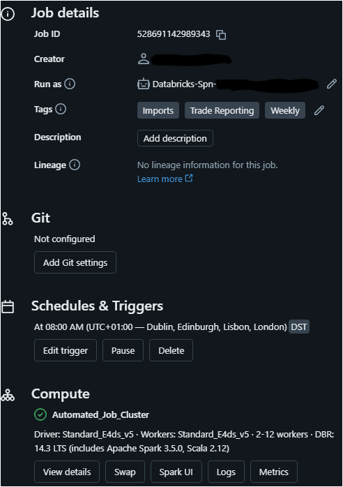

<p align="left">
    <a href="https://github.com/charithrd/Impact-Evaluation/commits/master">
    


## Table of Contents

[1. Executive Summary](#Chapter-1-Executive-Summary)

[2. Project Overview](#Chapter-2-Project-Overview)

[2.1 Problem Statement](#21-Problem-Statement)

[2.2 Solution](#22-Solution)

[2.3 Impact Assessment](#23-Impact-Assessment)

[3. ETL Pipeline](#Chapter-3-ETL-Pipeline-and-Automation)

[4. Data Structure](#Chapter-4-Data-Structure)

[5. Building the Data Model](#Chapter-5-Building-the-Data-Model)

[5.1 Data Selection and Preparation](#51-Data-Selection-and-Preparation)

[5.2 Data Manipulation](#52-Data-Manipulation)

[5.3 Data Joins](#53-Data-Joins)


> ## Chapter 1 Executive Summary

Owing to the volatility inherent in international shipping routes, it is imperative for global retailers to accurately monitor their inventory in transit to ensure they can adequately meet customer demand.

KPMG (2023) research states that “global and local retailers may need to review their inventory distribution network”. Furthermore, the latest statistics illustrate that “53% of ecommerce retailers find shipping and logistics processes challenging” (Meteor Space, 2022).

This explores Impact evaluation on an automated business project deployed in 2023, analysing vessels en route to UK ports (stock due weekly). Adhering to the Data Protection Act 2018 (Legislation.gov.uk, 2018), business data are not published and have been anonymized.

> ## Chapter 2 Project Overview
To stay competitive many retailers have moved ‘their manufacturing to low-cost countries’ (Arrigo, 2020). Landing these products on the shop floor on time involves major planning for the logistics team.

Adding more complexity to this context are shipping disruptions in international shipping routes and ports. Hence actively monitoring stock arrivals and adjusting warehouse planning are vital to improve sales and customer satisfaction.

This process is called vessel en-route analysis. Historically this process was completed using Excel spreadsheets retrieving the data from a legacy system and comparing it against another report produced by freight forwarders to identify any late vessel arrivals due weekly.

Recently business has moved from on-premise servers to Azure cloud-based platform. Capitalizing on this infrastructure change and supporting business growth sets the right grounds for automating this workflow and introducing data visualization using Power BI.

### 2.1 Problem Statement
Due to the business growth, there has been substantial use of underlying data usage to complete the process. Multiple users need to join to complete the process. This has resulted in shared Excel workbooks crashing and being unable to save their work. Furthermore, manual user intervention was prone to errors. Hence scalability and reliability were the key concerns.

### 2.2 Solution
ETL framework has been developed using Azure Databricks cloud platform, adopting data security measures. Also created workflows within the Databricks platform and fully automated the ETL pipeline ensuring data accuracy. Finally, the refined dataset is loaded into Power BI, enabling users to access deep insights.

### 2.3 Impact Assessment

#### 2.3.1 Positives
•	Manual user intervention in producing the report has been eliminated. This is estimated to be three hours weekly by two colleagues. Total time saved approximately 156 hours per annum.

•	Shadow deployment strategy has been utilized where the model is compared to “human judgment before putting it into production” (BPP School of Technology, 2024). No deviations from manual records illustrated the model's accuracy and reliability.

•	Ability to scale up reporting times from weekly to daily if required by business.

#### 2.3.2 Negatives
•	Any future improvements to the solution require “dedicated engineers to handle the development” (Palmer, 2024) due to the technical aspects.

#### 2.3.3 Conclusion
In conclusion, implementing this ETL Framework and reporting has yielded significant benefits by eliminating manual user intervention and enhancing reporting accuracy. Thus, maintenance of the data model requires a team member with technical experience.


> ## Chapter 3 ETL Pipeline and Automation


Above, high level ETL Pipeline is summarized as follows.

### Source: 
 - Structured Azure SQL databases are the primary source.
   
### Data Governance: 
 - Azure Active Directory (AD) is the security layer before extraction.
 - Considering data privacy only the necessary data is processed, and no personal data has been utilized for this project.
   
### ETL Flow:

Azure Databricks
•	Using SQL Notebook key data is extracted from the source.
•	Data is then transformed using deduplication, cleaning, and aggregation techniques enabling further analysis.
•	Azure Notebook is attached to a workflow automating the job run.
•	Notebook output is loaded into Databricks Unity catalogue.
•	Finally, the unity catalogue output is connected to Power BI for visualization.


### Workflow Automation:

 - Databricks notebook is attached to a workflow within a cluster.
 - This job is scheduled to run as per the business's desired time frames.
 - Any workflow failures will get notified to the Admin users via work email.





> ## Chapter 4 Data Structure

Below are the metadata characteristics of the final data load to the Power BI model.


> ## Chapter 5 Building the Data Model

### 5.1 Data Selection and Preparation

 - The ‘Create or Replace Table’ statement creates a new table called ‘Vessel_En_Route’.
 - Essential fields are added to the select statement.


```sql
create or replace table Vessel_En_Route

SELECT v.vy_journey_no as Voyage,
       v.vy_vessel_name as Vessel_name,
       v.vy_arrive_loc as Port_Arrival_Code,
       date( v.vy_arrive_date) AS ArrivedDate,
       date(comb.whsdeldate) AS WhseDelDate,
       lu.country_code,
       s.fm_status,
       s.planned_dest_code,
       Case   When trim(s.planned_dest_code) = 'P' then 'Dxxxxxxx'
		      When trim(s.planned_dest_code) = 'D' then 'Dxx'
			  When trim(s.planned_dest_code) = 'DF' then 'Dxxxxxxx'
			  When trim(s.planned_dest_code) = 'H' then 'Sxxxxxxx'
			  When trim(s.planned_dest_code) = 'X' then 'Exxxxxxx'
			  When trim(s.planned_dest_code) = 'V' then 'Dxx'
			  When trim(s.planned_dest_code) = 'XD' then 'Exxxxxxx'
			  When trim(s.planned_dest_code) = 'S' then 'Sxxxxxxx'
			  When trim(s.planned_dest_code) = 'M' then 'Txxxxxxx'
			  When trim(s.planned_dest_code) = '56' then 'Txxxxxxx'
			  When trim(s.planned_dest_code) = '97' then 'Txxxxxxx'
			  else 'Other'
			  end as Depot_Name,
       comb.contractno,
       comb.deliveryno,
       array_join(array(comb.contractno , comb.deliveryno),'') As ContractDel,
       c.vy_partner_cnt_no as Container_No,
       SUM(comb.balleft * i.ret_sell_price) AS RSV
```

### 5.2 Data Manipulation

 - Below manipulation steps “includes variable-by-variable transformation, as well as aggregation” (Wickham, 2014).
 - Converting Datetime fields such as v. vy_arrive_date into a date field.
 - A case statement converts warehouse codes in the ‘Planned_dest_code’ field into Warehouse names. 
 - Using an array join statement ContractNo and DeliveryNo fields are concatenated into a single column. This step helps users to search warehouse deliveries easily.
 - Retail Sales Value (RSV) – By multiplying the balance left with the retail sell price we determine the row (option) level retail value.
 - Then Sum () function calculates the total sum of the product across all rows in the dataset. Finally, the data type is cast to an Integer (INT).

### 5.3 Data Joins

 - The primary data source of this project satisfies the third normal form (3NF). Chakraborty et al., 2021 claim that “3NF can reduce redundancies and anomalies from a relational database”.
   
 - The query results are constrained by the ‘WHERE’ clause.
 - To adhere to the 'Uniqueness' dimension of data quality, we have employed the 'GROUP BY' clause.
 - According to Kushtagi (2023), “data deduplication can be achieved using various methods, such as using the DISTINCT keyword, GROUP BY” clause.

```sql
FROM xxxx_dss.dp_itemoption as I
        
   INNER JOIN xxxx_dss.contract_combined as comb
        ON ( comb.itemcode = LEFT(i.itemoption_code,6)
        AND comb.optionno = SUBSTRING(i.itemoption_code,7, 2))
        
   INNER JOIN xxxx_dss.dg_country as lu 
        ON ( comb.countryofdesp = lu.country_code)
            
  LEFT OUTER JOIN xxxx_dss.fm_status as s
        ON ( comb.contractno = s.contract_no
        AND comb.deliveryno = CAST(s.delivery_no AS INTEGER))
            
  LEFT OUTER JOIN xxxx_dss.fm_cnt_copts as cc
        ON ( cc.vy_contract_no = comb.contractno
        AND cc.vy_contract_del = comb.deliveryno
        AND cc.vy_contract_option = comb.optionno
                                  )
  INNER JOIN xxxx_dss.fm_containers as c
        ON ( c.vy_journey_seq_no = cc.vy_journey_seq_no
        AND c.vy_container_no = cc.vy_container_no)
            
  LEFT OUTER JOIN xxxx_dss.fm_voyage as v
       ON ( v.vy_journey_seq_no = c.vy_journey_seq_no )
        
WHERE 
       comb.DtlTransportmode = 'S' --- S = SeaFreight
       AND s.fm_status BETWEEN '40' AND '50'
       AND  v.vy_arrive_loc  LIKE  'GB%'
       
GROUP BY 
        v.vy_journey_no,
        v.vy_vessel_name,
        v.vy_arrive_loc,
        date(v.vy_arrive_date),
        date(comb.whsdeldate),
        lu.country_code,
        s.fm_status,
        s.planned_dest_code,
        comb.contractno,
        comb.deliveryno,
        c.vy_partner_cnt_no
       
HAVING  (SUM(comb.balleft * i.ret_sell_price) > 0 )
```
